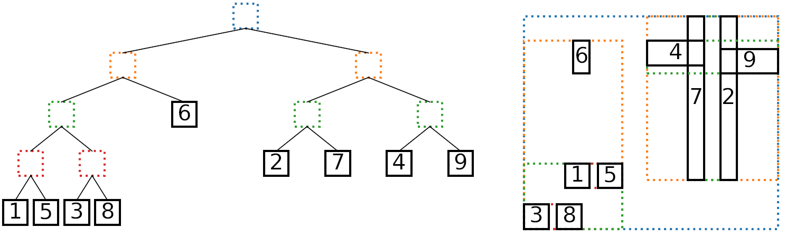

.. AABBTree documentation master file.

.. include:: ../../README.rst
    :end-before: .. begin-badges

.. Introduction
.. include:: ../../README.rst
    :start-after: .. begin-introduction
    :end-before: .. end-introduction

.. Image of AABB Tree

  Left: An AABB tree, leaves numbered by insertion order.
  Right: The AABBs and their bounding boxes.

.. Installation and example sections
.. include:: ../../README.rst
  :start-after: .. begin-installation
  :end-before: .. begin-documentation

.. API
.. include:: aabbtree.rst

.. Contributing and license
.. include:: ../../README.rst
  :start-after: .. end-documentation

.. admonition:: License

  .. include:: ../../LICENSE.rst
